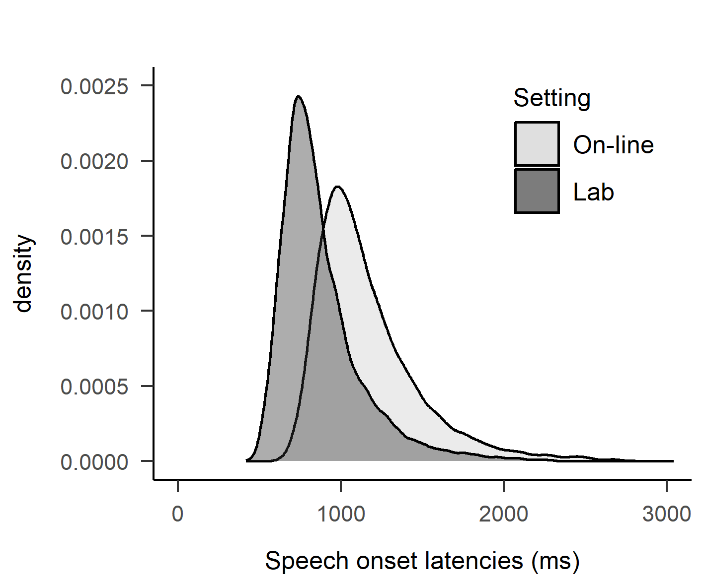

# Online-Data-Collection

With the pandemic, many experimental psychologists/linguists have started to collect data over the internet (thereafter “on-line data”). It is often assumed that data collected over the internet are more variable than lab data. The aim of this project is to determine whether this is true and if so, assess the extent and sources of this variability: are the data more variable because participants differ more from one another? Or are the participants more variable themselves (because they are more distracted or because many things are going on at once on their computer).

Knowledge about the extent and sources of variability is necessary to determine the feasibility of such experiments and compute the sample sizes required to achieve suffcient statistical power in future experiments. 

So, are on-line data more variable? The graph below suggests that they are.

Analyses suggest:
- that on-line data are more variable
- that the varibility mostly stem from differences between participants

So, do we need larger sample sizes than in a lab experiment?

- For between-participant designs, for sure
- For within participant designs, not necessarily
- Large sample sizes (items and participants) are needed both in the lab and on-line for most designs in psycholinguistic research. The graphs below show power as a function of numbder of participants for typcail effect sizes, 90 items per condition. Power is likely underestimated (because the by participant random slope is liekly underestimated)

